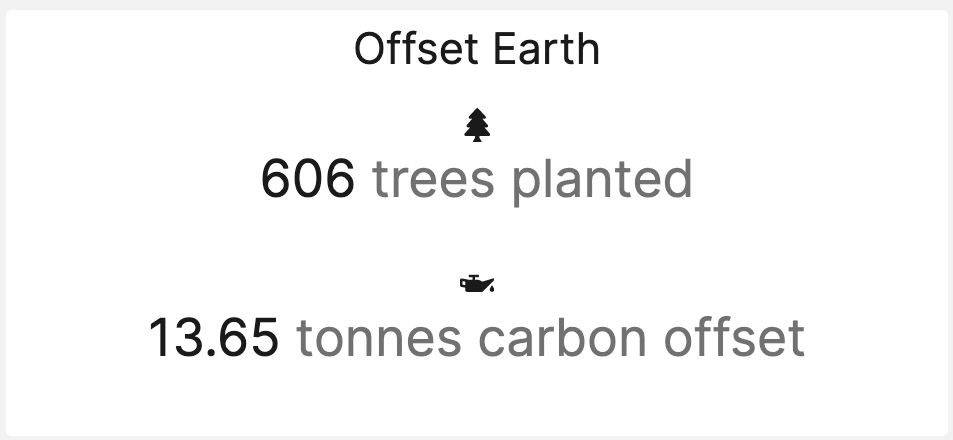

# Ecologi Tile

[![Latest Version on Packagist][ico-version]][link-packagist]
[![Software License][ico-license]](LICENSE.md)
[![Build Status][ico-github-actions]][link-github-actions]
[![Style CI][ico-styleci]][link-styleci]
[![Code Coverage][ico-code-coverage]][link-code-coverage]
[![Total Downloads][ico-downloads]][link-downloads]
[![Buy us a tree][ico-treeware-gifting]][link-treeware-gifting]

A tile for Laravel Dashboard that displays statistics from Ecologi



## Install

Via Composer

```bash
$ composer require owenvoke/laravel-dashboard-offset-earth-tile
```

## Usage

In the `dashboard` config file, you must add this configuration in the `tiles` key.

```php
// in config/dashboard.php

return [
    // ...
    'tiles' => [
        'offset_earth' => [
            'username' => env('OFFSET_EARTH_USERNAME'),
        ],
    ],
];
```

In `app\Console\Kernel.php` you should schedule the `OwenVoke\OffsetEarthTile\Commands\FetchOffsetEarthStatisticsCommand` to run every `30` minutes.

```php
// in app/console/Kernel.php

protected function schedule(Schedule $schedule)
{
    $schedule->command(OwenVoke\OffsetEarthTile\Commands\FetchOffsetEarthStatisticsCommand::class)->everyThirtyMinutes();
}
```

In your dashboard view you use the `livewire:offset-earth-tile` component.

```blade
<x-dashboard>
    <livewire:offset-earth-tile position="a1" />
</x-dashboard>
```

## Change log

Please see [CHANGELOG](CHANGELOG.md) for more information on what has changed recently.

## Testing

```bash
$ composer test
```

## Contributing

Please see [CONTRIBUTING](.github/CONTRIBUTING.md) for details.

## Security

If you discover any security related issues, please email security@voke.dev instead of using the issue tracker.

## Credits

- [Owen Voke][link-author]
- [All Contributors][link-contributors]

## License

The MIT License (MIT). Please see [License File](LICENSE.md) for more information.

## Treeware

You're free to use this package, but if it makes it to your production environment you are required to buy the world a tree.

It’s now common knowledge that one of the best tools to tackle the climate crisis and keep our temperatures from rising above 1.5C is to plant trees. If you support this package and contribute to the Treeware forest you’ll be creating employment for local families and restoring wildlife habitats.

You can buy trees [here][link-treeware-gifting].

Read more about Treeware at [treeware.earth][link-treeware].

[ico-version]: https://img.shields.io/packagist/v/owenvoke/laravel-dashboard-offset-earth-tile.svg?style=flat-square
[ico-license]: https://img.shields.io/badge/license-MIT-brightgreen.svg?style=flat-square
[ico-github-actions]: https://img.shields.io/github/workflow/status/owenvoke/laravel-dashboard-offset-earth-tile/Continuous%20Integration.svg?style=flat-square
[ico-styleci]: https://styleci.io/repos/261989893/shield
[ico-code-coverage]: https://img.shields.io/codecov/c/github/owenvoke/laravel-dashboard-offset-earth-tile.svg?style=flat-square
[ico-downloads]: https://img.shields.io/packagist/dt/owenvoke/laravel-dashboard-offset-earth-tile.svg?style=flat-square
[ico-treeware-gifting]: https://img.shields.io/badge/Treeware-%F0%9F%8C%B3-lightgreen?style=flat-square

[link-packagist]: https://packagist.org/packages/owenvoke/laravel-dashboard-offset-earth-tile
[link-github-actions]: https://github.com/owenvoke/laravel-dashboard-offset-earth-tile/actions
[link-styleci]: https://styleci.io/repos/261989893
[link-code-coverage]: https://codecov.io/gh/owenvoke/laravel-dashboard-offset-earth-tile
[link-downloads]: https://packagist.org/packages/owenvoke/laravel-dashboard-offset-earth-tile
[link-treeware]: https://treeware.earth
[link-treeware-gifting]: https://ecologi.com/owenvoke?gift-trees
[link-author]: https://github.com/owenvoke
[link-contributors]: ../../contributors
